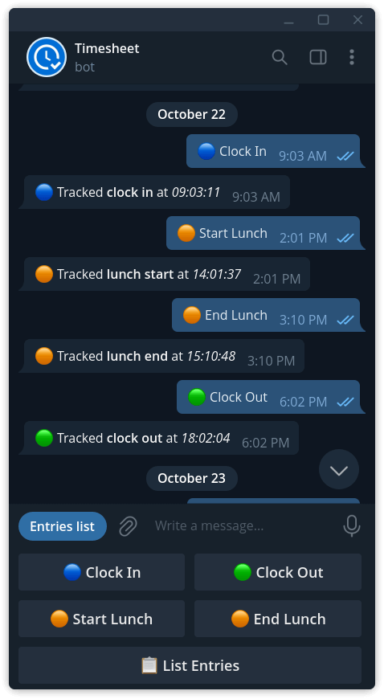
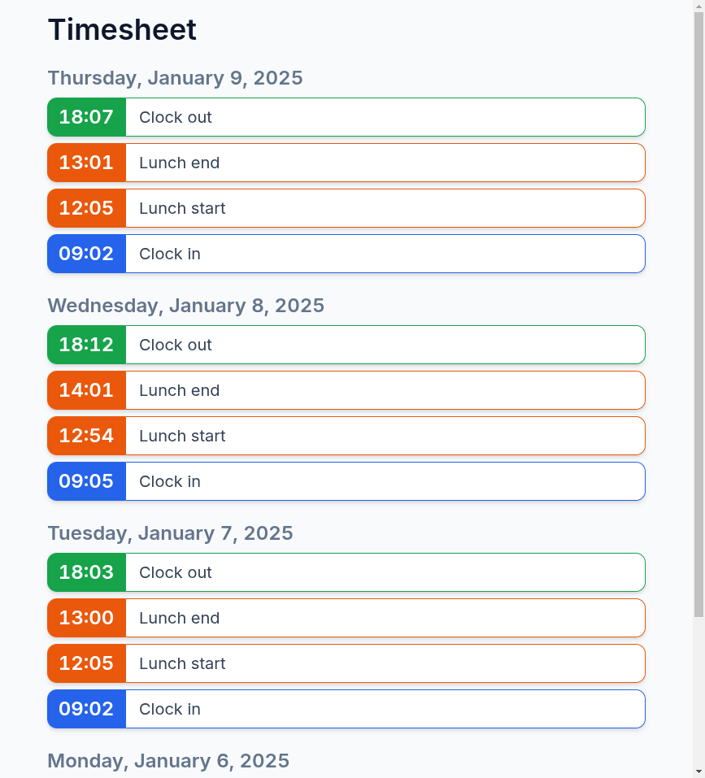

# Telegram Timesheet

This project is a simple Telegram bot to track work-related events and display them using web ui.

Currently, four types of entries are supported: clock in, clock out, lunch start and end.

**Because this is a hobby project there are many limitations for production use**:
* there is no separate buckets for each user data. Essentially this means that bot is a "singleton" for each telegram user and it shares data between them
* there is no protection on Web UI although it is read only, but this can be seen as a little privacy concern
* there is no pagination on Web UI which will eventually increase delay in page loading after continuous use

## Demo

<table style="width: 100%; text-align: center;">
  <tr>
    <td>
      
       
      <strong>Telegram Bot</strong>
      
You can enter the data using Telegram Bot

    </td>
    <td>
      
       
      <strong>Web Interface</strong>
      
And you can view all entries using a Web UI

    </td>
  </tr>
</table>

## Architecture

The application is built using a serverless architecture:
* Database is hosted on Upstash Redis to store user data
* Telegram bot is built using Telegraf library and responds to messages in Webhook mode. It is hosted on Netlify Functions which are used as a webhook.
* Web UI is built using vanilla JS and Tailwind CSS. It is also served using Netlify Functions to render HTML and pull user data from Upstash Redis
